# ChartForgeX Markup

ChartForgeX markup is a Markdown-friendly authoring layer for deterministic ChartForgeX visuals. It scans ordinary Markdown for known visual fences, keeps line-aware diagnostics, and converts supported blocks into reusable ChartForgeX models instead of browser-only script output.

Supported fences may use backticks or tildes. Fence attributes use Markdown-style metadata such as `{#id title="Service Map" width=1280 height=760}` and are preserved on the `VisualMarkupBlock` for parsers that need host metadata.

The generic `ChartForgeX.Markup` package recognizes:

| Fence | Purpose |
| --- | --- |
| `chartforgex topology`, `chartforgex-topology`, `cfx topology`, `cfx-topology` | Product-neutral topology diagrams. |
| `chartforgex table`, `cfx table` | Reusable `TableArtifact` definitions with static preview rendering. |
| `chartforgex flow`, `cfx flow` | Reserved ChartForgeX flow artifact fence. |
| `chartforgex chart`, `cfx chart` | Native ChartForgeX chart artifact fence. |
| `chartforgex timeline`, `cfx timeline` | Reserved ChartForgeX timeline artifact fence. |
| `mermaid` | Recognized as a visual block. Parsing requires `ChartForgeX.Markup.Mermaid`. |

Unsupported `chartforgex` or `cfx` family fences produce diagnostics instead of being silently ignored. The parser also accepts custom block parsers through `IVisualMarkupBlockParser`, so optional packages can add real behavior without making the core markup package depend on them.

Standalone tools can call `VisualMarkupParser.Parse(markdown)` and let ChartForgeX scan Markdown itself. Hosts that already parse Markdown, such as OfficeIMO-backed IX pipelines, should pass their discovered visual fences through `VisualMarkupParser.ParseBlocks(blocks)` instead. That keeps one Markdown source of truth while preserving ChartForgeX's line-aware diagnostics, artifact conversion, and static rendering.

The host integration shape is:

```csharp
using ChartForgeX.Markup;

var blocks = new[] {
    new VisualMarkupBlock(
        VisualMarkupKind.Chart,
        "chartforgex chart",
        "chartforgex chart {#trend title=\"Trend\"}",
        "type line\nlabels Jan Feb Mar\nvalues 12 18 16",
        fenceLine: 24,
        startLine: 25,
        endLine: 27,
        attributes: new Dictionary<string, string> {
            ["id"] = "trend",
            ["title"] = "Trend"
        })
};

var result = new VisualMarkupParser().ParseBlocks(blocks);
```

OfficeIMO or another Markdown-native host owns Markdown parsing, fence discovery, and any document-native metadata. ChartForgeX owns visual payload parsing, diagnostics, reusable models, and deterministic static previews.

## Topology

Use command-style lines for small diagrams:

````markdown
```chartforgex topology
id service-map
title "Service Dependency Map"
subtitle "Production dependencies and latency"
viewport 1280x760 32
layout layered lr

group platform "Platform" status:healthy color:#2563eb icon:service
group data "Data Layer" status:warning color:#f59e0b icon:database

node api "Public API" kind:service group:platform status:healthy icon:service badge:v2
node worker "Billing Worker" kind:process group:platform status:warning icon:worker
node sql "SQL Primary" kind:database group:data status:warning icon:database subtitle:"failover lag 2m"

edge api -> worker "queue" kind:dataflow status:warning direction:forward
edge worker -> sql "84 ms" kind:dependency status:warning direction:forward
```
````

Use sections and pipe tables for larger diagrams that need to stay readable in code review:

````markdown
```chartforgex topology
title: "Regional Directory Topology"
layout: densegrouped tb

groups:
| id   | label | status  | icon              |
| ---- | ----- | ------- | ----------------- |
| emea | EMEA  | warning | microsoft-ad:site |
| amer | AMER  | healthy | microsoft-ad:site |

nodes:
| id      | label     | group | kind   | status  | badge |
| ------- | --------- | ----- | ------ | ------- | ----- |
| dc-emea | EMEA DC01 | emea  | server | warning | GC    |
| dc-amer | AMER DC01 | amer  | server | healthy | GC    |

edges:
| from    | to      | label | status  | direction     |
| ------- | ------- | ----- | ------- | ------------- |
| dc-emea | dc-amer | 92 ms | warning | bidirectional |
```
````

This layer intentionally describes the topology model rather than raw drawing instructions. ChartForgeX owns deterministic layout, validation, SVG/HTML/PNG rendering, and generated fluent builder code.

## Tables

`chartforgex table` fences create reusable `TableArtifact` models. The core package renders a static preview through `TableArtifact.ToPreviewBlock()`, `ToSvg()`, and `ToPng()`. Capabilities describe what a rich host may offer; they do not force JavaScript into static ChartForgeX output.

````markdown
```chartforgex table {#alerts title="Open Alerts"}
capabilities search sort filter multiselect copy export virtualization
totalRows 1280

columns:
| id       | label    | type   | alignment | searchable | sortable | filterable |
| -------- | -------- | ------ | --------- | ---------- | -------- | ---------- |
| severity | Severity | status | left      | true       | true     | true       |
| system   | System   | text   | left      | true       | true     | true       |
| count    | Count    | number | right     | false      | true     | false      |

rows:
| severity | system       | count |
| -------- | ------------ | ----- |
| warning  | Directory    | 12    |
| healthy  | Mail routing | 3     |
```
````

The table contract is deliberately product-neutral:

- `Search`, `Sort`, `Filter`, `SingleSelection`, `MultiSelection`, `CellSelection`, `Copy`, `Export`, and `Virtualization` are declared as capabilities.
- `TableArtifactQuery`, `TableArtifactSort`, `TableArtifactFilter`, `ITableArtifactDataProvider`, and `TableArtifactQueryResult` describe the data-provider boundary for large or remote tables.
- Static reports, emails, documentation, and previews can render without scripts.
- WinUI, web, or native hosts can bind the same artifact to richer controls when they own interaction, keyboard behavior, paging, clipboard, and export workflows.

See `visual-artifacts.md` for the reusable artifact model.

## Charts

`chartforgex chart` fences create native ChartForgeX `Chart` models. The initial fence is intentionally compact and useful for report/dashboard slices: `bar`, `line`, `area`, `horizontalbar`, and `pie` chart types can be authored with commands, values, or a simple Markdown table.

````markdown
```chartforgex chart {#result-mix title="Result Mix"}
type pie
series "Checks"
| Label    | Value |
| -------- | ----- |
| Passed   | 1260  |
| Warnings | 68    |
| Failed   | 10    |
```
````

For small trend charts, command form stays concise:

````markdown
```chartforgex chart
id trend
title "Trend"
type line
labels Jan Feb Mar
values 12 18 16
```
````

The parser maps the fence to a `VisualArtifact` with `VisualArtifactKind.Chart` and a typed `Chart` model. Static SVG/PNG/HTML export remains deterministic and script-free.

## Mermaid

Mermaid fences are intentionally optional. `ChartForgeX.Markup` can scan them, but it does not parse Mermaid syntax by itself. Add `ChartForgeX.Markup.Mermaid` when Markdown should produce Mermaid-backed visual artifacts:

```csharp
using ChartForgeX.Markup.Mermaid;

var result = new MermaidVisualMarkupParser().Parse(markdown);
```

If a host has already discovered Mermaid fences, it can use the same pre-scanned block flow:

```csharp
var result = new MermaidVisualMarkupParser().ParseBlocks(blocks);
```

The bridge keeps the dependency boundary clean: `ChartForgeX.Mermaid` owns Mermaid parsing and conversion, while `ChartForgeX.Markup.Mermaid` only adapts Markdown fence metadata and diagnostics into the generic markup result.

````markdown
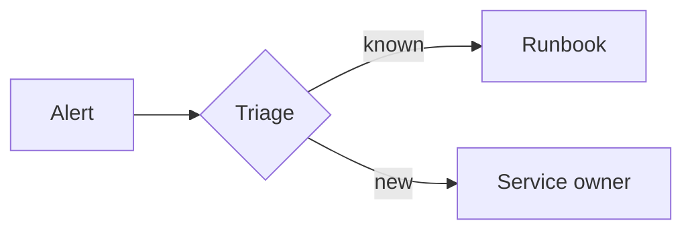
````

Current Mermaid support is described in `mermaid.md`. Flowcharts, sequence diagrams, class diagrams, state diagrams, entity relationship diagrams, requirement diagrams, architecture diagrams, C4 diagrams, git graph diagrams, block diagrams, packet diagrams, Venn diagrams, Ishikawa diagrams, Wardley maps, mindmaps, tree views, event modeling diagrams, kanban boards, pie charts, journeys, timelines, quadrant charts, Gantt diagrams, XY charts, Sankey diagrams, radar diagrams, and treemap diagrams render through ChartForgeX today. Other recognized Mermaid families are detected and reported as not-yet-implemented instead of being treated as generic text.

Mermaid chart syntax remains Mermaid syntax. Use `xychart-beta` when authors want Mermaid-compatible line and bar charts:

````markdown
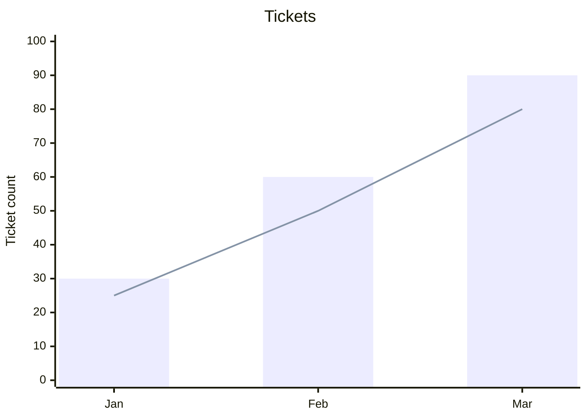
````

Use `chartforgex chart` when authors want ChartForgeX-native chart types or IX-specific visual artifact behavior that Mermaid does not define.

Sankey fences use Mermaid's CSV-like syntax and render through native ChartForgeX Sankey charts:

````markdown
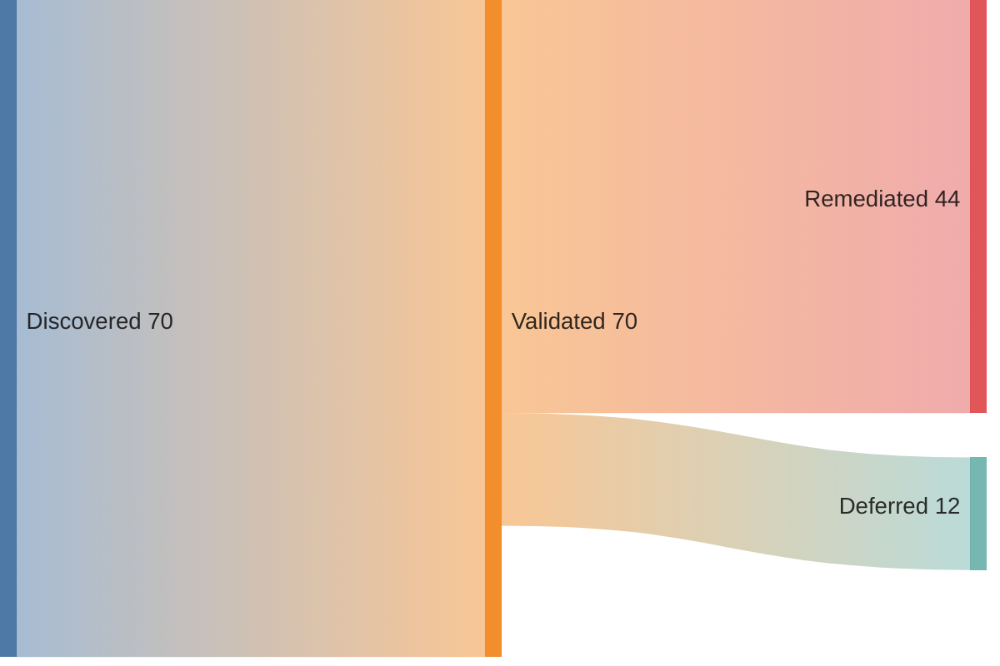
````

Radar fences use Mermaid's `radar-beta` syntax and render through native ChartForgeX radar charts:

````markdown
```mermaid {#capability-radar title="Capability Radar" width=900 height=620}
radar-beta
axis ux["User Experience"], api["API"], ops["Operations"]
curve current["Current"]{70, 65, 82}
curve target["Target"]{ux: 90, api: 88, ops: 92}
min 0
max 100
ticks 5
```
````

Treemap fences use Mermaid's `treemap-beta` syntax and render through native ChartForgeX treemap charts:

````markdown
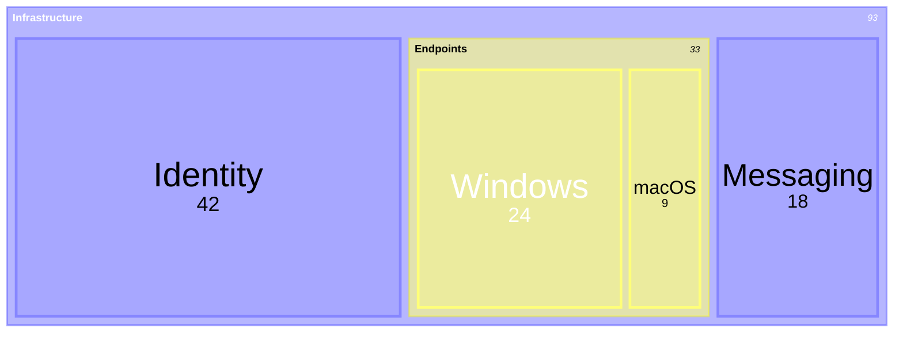
````

Gantt fences use Mermaid's `gantt` syntax and render through native ChartForgeX Gantt charts:

````markdown
```mermaid {#project-plan title="Project Plan" width=960 height=560 today=2026-01-08}
gantt
dateFormat YYYY-MM-DD
axisFormat %m/%d
section Build
Design : active, des, 2026-01-01, 5d
Implement : crit, impl, after des, 7d
Ship : milestone, ship, after impl, 0d
```
````

Git graph fences use Mermaid's `gitGraph` syntax and render through the reusable ChartForgeX git graph block:

````markdown
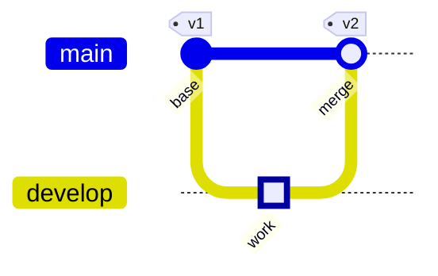
````

Packet fences use Mermaid's `packet-beta` syntax and render through the reusable ChartForgeX packet layout block:

````markdown
```mermaid {#tcp-header title="TCP Header" width=900 height=420 bitsPerRow=32}
packet-beta
0-15: "Source Port"
+16: "Destination Port"
32-63: "Sequence Number"
+32: "Acknowledgment Number"
```
````

Block fences use Mermaid's `block-beta` syntax and render through the reusable ChartForgeX block layout block:

````markdown
```mermaid {#service-path title="Service Path" width=900 height=420 columns=3}
block-beta
columns 3
frontend["Frontend"] api["API"] database[("Database")]
frontend --> api
api --> database
```
````

Venn fences use Mermaid's `venn-beta` syntax and render through the reusable ChartForgeX Venn diagram block:

````markdown
```mermaid {#capability-overlap title="Capability Overlap" width=780 height=460}
venn-beta
title Capability overlap
set API ["API"] : 60
set UI ["UI"] : 55
set Ops ["Operations"] : 45
union API,UI ["Shared UX"] : 18
union API,UI,Ops ["Platform"] : 5
```
````

Ishikawa fences use Mermaid's `ishikawa` and `ishikawa-beta` syntax and render through the reusable ChartForgeX fishbone block:

````markdown
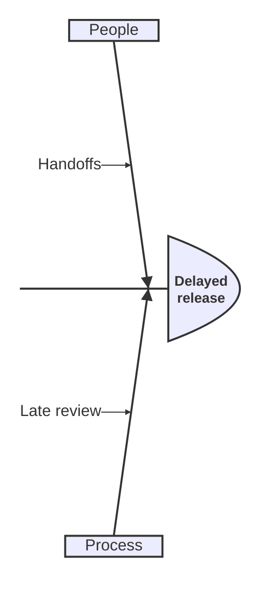
````

Wardley fences use Mermaid's `wardley-beta` syntax and render through the reusable ChartForgeX Wardley map block:

````markdown
```mermaid {#platform-map title="Platform Map" width=900 height=560}
wardley-beta
anchor User [0.95, 0.05]
component Portal [0.80, 0.35]
component API [0.70, 0.45]
User -> Portal
Portal -> API
```
````

TreeView fences use Mermaid's `treeView-beta` syntax and render through native ChartForgeX topology previews:

````markdown
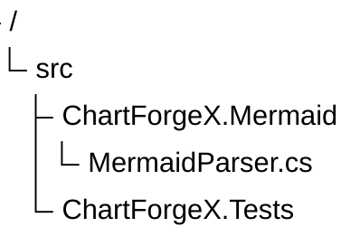
````

Event Modeling fences use Mermaid's `eventmodeling` syntax and render through native ChartForgeX topology previews:

````markdown
```mermaid {#cart-event-model title="Cart Event Model" width=960 height=560}
eventmodeling
tf 01 ui CartUI
tf 02 cmd AddItem
tf 03 evt ItemAdded
tf 04 rmo CartView ->> 03
```
````

Class, state, ER, requirement, architecture, C4, mindmap, and kanban fences render through native ChartForgeX topology previews:

````markdown
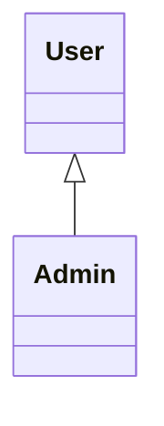
````

````markdown
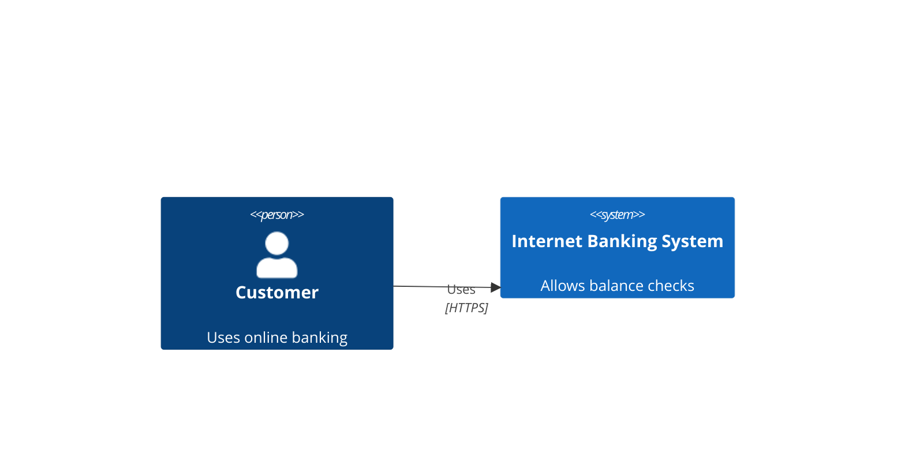
````

````markdown
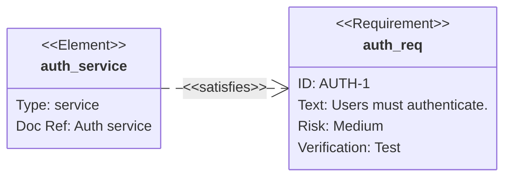
````

````markdown
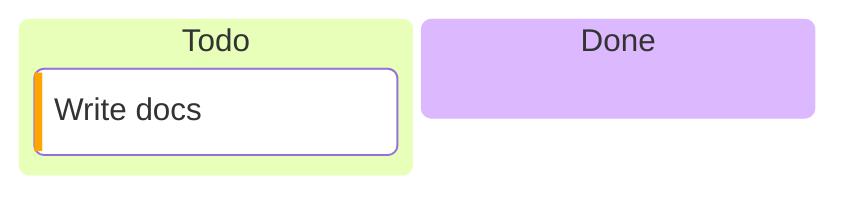
````

## CLI

The CLI can validate, export, and generate C# builder code:

```powershell
dotnet run --project .\ChartForgeX.Markup.Cli\ChartForgeX.Markup.Cli.csproj -c Release -- validate .\diagram.md
dotnet run --project .\ChartForgeX.Markup.Cli\ChartForgeX.Markup.Cli.csproj -c Release -- preview .\diagram.md --output .\diagram.html
dotnet run --project .\ChartForgeX.Markup.Cli\ChartForgeX.Markup.Cli.csproj -c Release -- export .\diagram.md --output .\diagram.svg
dotnet run --project .\ChartForgeX.Markup.Cli\ChartForgeX.Markup.Cli.csproj -c Release -- emit .\diagram.md --target csharp --output .\diagram.cs
```

## VS Code extension

`ChartForgeX.Markup.VSCode` follows the same CLI-backed packaging model as `OfficeIMO.Markup.VSCode`. The extension shell stays thin: VS Code handles activation, commands, diagnostics, preview panels, and save dialogs, while `ChartForgeX.Markup.Cli` owns parsing, validation, rendering, export, and C# code generation.

The extension contributes a `chartforgex-markup` language for `.cfx.md` and `.chartforgex.md`, snippets for fenced topology blocks, and commands for preview, validate, SVG/PNG/HTML export, C# generation, and opening the generated output folder. Packaging publishes the CLI into `tools/ChartForgeX.Markup.Cli` as a portable fallback plus self-contained runtime builds for Windows, Linux, and macOS.
