# ChartForgeX Markup

ChartForgeX markup is a Markdown-friendly authoring layer for deterministic ChartForgeX visuals. It scans ordinary Markdown for known visual fences, keeps line-aware diagnostics, and converts supported blocks into reusable ChartForgeX models instead of browser-only script output.

Supported fences may use backticks or tildes. Native ChartForgeX fences are versioned with the canonical form `chartforgex <kind> v1`; the version is part of the public authoring contract so future grammar changes can be introduced intentionally. Fence attributes use Markdown-style metadata such as `{#id title="Service Map" width=1280 height=760}` and are preserved on the `VisualMarkupBlock` for parsers that need host metadata.

For the strict grammar and API contract, see `markup-v1-reference.md`. The machine-readable editor schema is packed as `schemas/chartforgex-markup-v1.schema.json` in `ChartForgeX.Markup` and mirrored in the VS Code extension. This file is the authoring guide; the reference file and schema are the compatibility contract for v1 parsers and host integrations.

The generic `ChartForgeX.Markup` package recognizes:

| Fence | Purpose |
| --- | --- |
| `chartforgex topology v1` | Product-neutral topology diagrams. |
| `chartforgex table v1` | Reusable `TableArtifact` definitions with static preview rendering. |
| `chartforgex flow v1` | Process and dependency flows backed by `FlowArtifact`. |
| `chartforgex chart v1` | Native ChartForgeX chart artifact fence. |
| `chartforgex timeline v1` | Native timeline and Gantt chart artifact fence. |
| `chartforgex sequence v1` | Interaction diagrams backed by `SequenceArtifact`. |
| `mermaid` | Recognized as a visual block. Parsing requires `ChartForgeX.Markup.Mermaid`. |

Unsupported or unversioned `chartforgex` family fences produce diagnostics instead of being silently ignored. The parser also accepts custom block parsers through `IVisualMarkupBlockParser`, so optional packages can add real behavior without making the core markup package depend on them.

Standalone tools can call `VisualMarkupParser.Parse(markdown)` and let ChartForgeX scan Markdown itself. Hosts that already parse Markdown, such as OfficeIMO-backed IX pipelines, should pass their discovered visual fences through `VisualMarkupParser.ParseBlocks(blocks)` instead. That keeps one Markdown source of truth while preserving ChartForgeX's line-aware diagnostics, artifact conversion, and static rendering.

The host integration shape is:

```csharp
using ChartForgeX.Markup;

var blocks = new[] {
    new VisualMarkupBlock(
        VisualMarkupKind.Chart,
        "chartforgex chart",
        "chartforgex chart v1 {#trend title=\"Trend\"}",
        schemaVersion: 1,
        "type line\nlabels Jan Feb Mar\nvalues 12 18 16",
        fenceLine: 24,
        startLine: 25,
        endLine: 27,
        attributes: new Dictionary<string, string> {
            ["id"] = "trend",
            ["title"] = "Trend"
        })
};

var result = new VisualMarkupParser().ParseBlocks(blocks);
```

OfficeIMO or another Markdown-native host owns Markdown parsing, fence discovery, and any document-native metadata. ChartForgeX owns visual payload parsing, diagnostics, reusable models, and deterministic static previews.

## Topology

Use command-style lines for small diagrams:

````markdown
```chartforgex topology v1
id service-map
title "Service Dependency Map"
subtitle "Production dependencies and latency"
viewport 1280x760 32
layout layered lr

group platform "Platform" status:healthy color:#2563eb icon:service
group data "Data Layer" status:warning color:#f59e0b icon:database

node api "Public API" kind:service group:platform status:healthy icon:service badge:v2
node worker "Billing Worker" kind:process group:platform status:warning icon:worker
node sql "SQL Primary" kind:database group:data status:warning icon:database subtitle:"failover lag 2m"

edge api -> worker "queue" kind:dataflow status:warning direction:forward
edge worker -> sql "84 ms" kind:dependency status:warning direction:forward
```
````

Use sections and pipe tables for larger diagrams that need to stay readable in code review:

````markdown
```chartforgex topology v1
title: "Regional Directory Topology"
layout: densegrouped tb

groups:
| id   | label | status  | icon              |
| ---- | ----- | ------- | ----------------- |
| emea | EMEA  | warning | microsoft-ad:site |
| amer | AMER  | healthy | microsoft-ad:site |

nodes:
| id      | label     | group | kind   | status  | badge |
| ------- | --------- | ----- | ------ | ------- | ----- |
| dc-emea | EMEA DC01 | emea  | server | warning | GC    |
| dc-amer | AMER DC01 | amer  | server | healthy | GC    |

edges:
| from    | to      | label | status  | direction     |
| ------- | ------- | ----- | ------- | ------------- |
| dc-emea | dc-amer | 92 ms | warning | bidirectional |
```
````

This layer intentionally describes the topology model rather than raw drawing instructions. ChartForgeX owns deterministic layout, validation, SVG/HTML/PNG rendering, and generated fluent builder code.

## Flow

`chartforgex flow v1` emits a typed `FlowArtifact` wrapped as `VisualArtifactKind.Flow`. Use it when the authored visual is a process, routing, approval, handoff, or dependency flow. Static SVG/PNG previews currently project the flow model through the deterministic topology renderer, but API consumers receive flow-specific lanes, steps, and connectors rather than topology groups, nodes, and edges.

````markdown
```chartforgex flow v1 {#pipeline title="Processing Flow"}
layout layered lr
lane ops "Operations"
start intake "Intake" lane:ops status:healthy
decision review "Review" lane:ops status:warning
data archive "Archive" lane:ops status:healthy
connect intake -> review "handoff" status:healthy
connect review -> archive "store" kind:data status:warning
```
````

Flow markup stays product-neutral. Hosts map their own business concepts into lanes, steps, and connectors, then use the artifact kind to decide where flow visuals belong in their own UI or document pipeline. Supported step commands include `step`, `process`, `decision`, `start`, `end`, `input`, `output`, `data`, `external`, `document`, `manual`, `delay`, and `event`. Connectors use `connect source -> target "label"` with optional `kind`, `direction`, `status`, and `color` attributes. Table sections are available as `lanes:`, `steps:`, and `connectors:` for larger flows.

## Sequence

`chartforgex sequence v1` emits a typed `SequenceArtifact` wrapped as `VisualArtifactKind.Sequence`. Use it when the authored visual is an interaction, request/response flow, protocol exchange, or ordered collaboration. Native sequence markup uses the same artifact model as Mermaid sequence conversion, but keeps ChartForgeX-owned commands and table sections for editor tooling and host APIs.

````markdown
```chartforgex sequence v1 {#incident title="Incident Sequence"}
actor user "User"
participant api "API"
database db "Database"
message user -> api "Submit request"
message api -> db "Store event" style:dashed
note rightOf api "Processing"
block loop "Retry" 0 1
```
````

Large sequence diagrams may use `participants:`, `messages:`, `notes:`, and `blocks:` sections. Participant kinds include `participant`, `actor`, `boundary`, `control`, `entity`, `database`, `collections`, and `queue`. Message styles are `solid` and `dashed`; note placements are `leftOf`, `rightOf`, and `over`; block kinds include `loop`, `alt`, `opt`, `par`, `critical`, `rect`, and `break`.

Sequence fences render through deterministic SVG/PNG/HTML export and preserve the typed `SequenceArtifact` model for host inspection. Rich behavior such as step playback, selection, zoom, or synchronized UI state belongs in adapters or consuming applications.

## Tables

`chartforgex table v1` fences create reusable `TableArtifact` models. The core package renders a static preview through `TableArtifact.ToPreviewBlock()`, `ToSvg()`, and `ToPng()`. Capabilities describe what a rich host may offer; they do not force JavaScript into static ChartForgeX output.

````markdown
```chartforgex table v1 {#alerts title="Open Alerts"}
capabilities search sort filter multiselect copy export virtualization
totalRows 1280

columns:
| id       | label    | type   | alignment | searchable | sortable | filterable |
| -------- | -------- | ------ | --------- | ---------- | -------- | ---------- |
| severity | Severity | status | left      | true       | true     | true       |
| system   | System   | text   | left      | true       | true     | true       |
| count    | Count    | number | right     | false      | true     | false      |

rows:
| severity | system       | count |
| -------- | ------------ | ----- |
| warning  | Directory    | 12    |
| healthy  | Mail routing | 3     |
```
````

The table contract is deliberately product-neutral:

- `Search`, `Sort`, `Filter`, `SingleSelection`, `MultiSelection`, `CellSelection`, `Copy`, `Export`, and `Virtualization` are declared as capabilities.
- `TableArtifactQuery`, `TableArtifactSort`, `TableArtifactFilter`, `ITableArtifactDataProvider`, and `TableArtifactQueryResult` describe the data-provider boundary for large or remote tables.
- Static reports, emails, documentation, and previews can render without scripts.
- WinUI, web, or native hosts can bind the same artifact to richer controls when they own interaction, keyboard behavior, paging, clipboard, and export workflows.

See `visual-artifacts.md` for the reusable artifact model.

## Charts

`chartforgex chart v1` fences create native ChartForgeX `Chart` models. The fence is intentionally compact, but it is not just a demo shortcut: common ChartForgeX chart types and render options can be authored with commands, `option key value` lines, or an `options:` table.

````markdown
```chartforgex chart v1 {#result-mix title="Result Mix"}
type pie
series "Checks"
| Label    | Value |
| -------- | ----- |
| Passed   | 1260  |
| Warnings | 68    |
| Failed   | 10    |
```
````

For small trend charts, command form stays concise:

````markdown
```chartforgex chart v1
id trend
title "Trend"
type line
labels Jan Feb Mar
values 12 18 16
```
````

Multi-series charts can be authored with explicit `series` commands:

````markdown
```chartforgex chart v1 {#mixed title="Mixed Series"}
labels Jan Feb Mar
series Revenue type smoothLine color #2563EB values 12 18 16
series Incidents type bar color #EF4444 values 3 4 2
```
````

Or with a review-friendly table. The first label/category column becomes the x-axis; each numeric column becomes a named series:

````markdown
```chartforgex chart v1 {#quarterly title="Quarterly Trend" type="line"}
| Month | Revenue | Cost |
| ----- | ------- | ---- |
| Jan   | 12      | 7    |
| Feb   | 18      | 9    |
| Mar   | 16      | 8    |
annotation hLine 15 "Target" color:#16A34A
```
````

ChartForgeX render options can live in a table when authors need review-friendly configuration:

````markdown
```chartforgex chart v1 {#trend title="Trend" type="smoothLine" width=720 height=420}
labels Jan Feb Mar
values 12 18 16

options:
| option | value |
| ------ | ----- |
| legend | false |
| dataLabels | true |
| legendPosition | topRight |
| xAxisTitle | Month |
| yAxisTitle | Count |
| yAxisMinimum | 0 |
| yAxisMaximum | 20 |
| grid | false |
```
````

Supported compact chart types include `bar`, `line`, `smoothLine`, `stepLine`, `area`, `smoothArea`, `stepArea`, `stackedArea`, `smoothStackedArea`, `scatter`, `lollipop`, `horizontalBar`, `waterfall`, `pie`, `donut`, `polarArea`, `radar`, and `funnel`. Series commands can choose their own `type`, `kind`, `color`, and `values`. Annotation commands support horizontal and vertical lines or bands through `annotation hLine`, `annotation vLine`, `annotation hBand`, and `annotation vBand`, with optional label, color, and opacity values. Supported options include legend, point legend, data labels, header/card/plot background, transparent background, axes, axis lines, grid, legend position, tick count, axis titles, axis bounds, padding, sparkline, and overlay mode. Invalid option values produce line-aware diagnostics.

The parser maps the fence to a `VisualArtifact` with `VisualArtifactKind.Chart` and a typed `Chart` model. Static SVG/PNG/HTML export remains deterministic and script-free.

## Timeline And Gantt

`chartforgex timeline v1` creates native ChartForgeX timeline or Gantt charts. Set `type` or `mode` to `timeline` or `gantt` in the fence attributes or inside the block. Dates use invariant date parsing; numeric positions are accepted for abstract schedules.

````markdown
```chartforgex timeline v1 {#release title="Release Plan" type="timeline" width=720 height=360}
item "Design" 2026-01-01 2026-01-07 color:#2563EB
milestone "Ship" 2026-01-14 color:#16A34A
```
````

Gantt authoring supports command rows and tables. Table columns can use `kind` or `type`, `label`/`name`/`item`/`task`, `start`, `end`, `progress`, `dependsOn`, and `color`.

````markdown
```chartforgex timeline v1 {#launch title="Launch Plan" type="gantt" today="2026-01-10"}
| kind      | label  | start      | end        | progress | dependsOn |
| --------- | ------ | ---------- | ---------- | -------- | --------- |
| task      | Build  | 2026-01-01 | 2026-01-12 | 0.5      |           |
| milestone | Launch | 2026-01-14 |            |          | 0         |
```
````

Timeline fences map to `VisualArtifactKind.Timeline` with a typed `Chart` model. They render through the same static SVG/PNG/HTML export path as code-created ChartForgeX timelines and Gantt charts.

## Mermaid

Mermaid fences are intentionally optional. `ChartForgeX.Markup` can scan them, but it does not parse Mermaid syntax by itself. Add `ChartForgeX.Markup.Mermaid` when Markdown should produce Mermaid-backed visual artifacts:

```csharp
using ChartForgeX.Markup.Mermaid;

var result = new MermaidVisualMarkupParser().Parse(markdown);
```

If a host has already discovered Mermaid fences, it can use the same pre-scanned block flow:

```csharp
var result = new MermaidVisualMarkupParser().ParseBlocks(blocks);
```

The bridge keeps the dependency boundary clean: `ChartForgeX.Mermaid` owns Mermaid parsing and conversion, while `ChartForgeX.Markup.Mermaid` only adapts Markdown fence metadata and diagnostics into the generic markup result.

````markdown
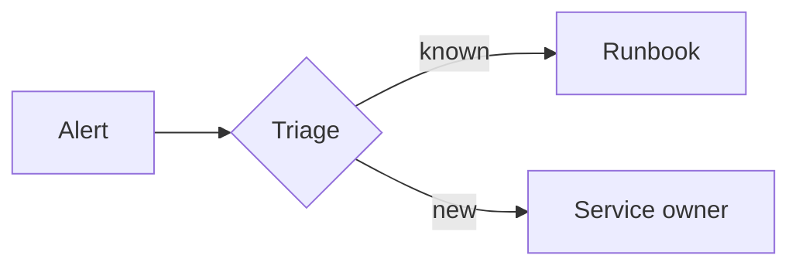
````

Current Mermaid support is described in `mermaid.md`. Flowcharts, sequence diagrams, class diagrams, state diagrams, entity relationship diagrams, requirement diagrams, architecture diagrams, C4 diagrams, git graph diagrams, block diagrams, packet diagrams, Venn diagrams, Ishikawa diagrams, Wardley maps, mindmaps, tree views, event modeling diagrams, kanban boards, pie charts, journeys, timelines, quadrant charts, Gantt diagrams, XY charts, Sankey diagrams, radar diagrams, and treemap diagrams render through ChartForgeX today. Other recognized Mermaid families are detected and reported as not-yet-implemented instead of being treated as generic text.

Mermaid chart syntax remains Mermaid syntax. Use `xychart-beta` when authors want Mermaid-compatible line and bar charts:

````markdown
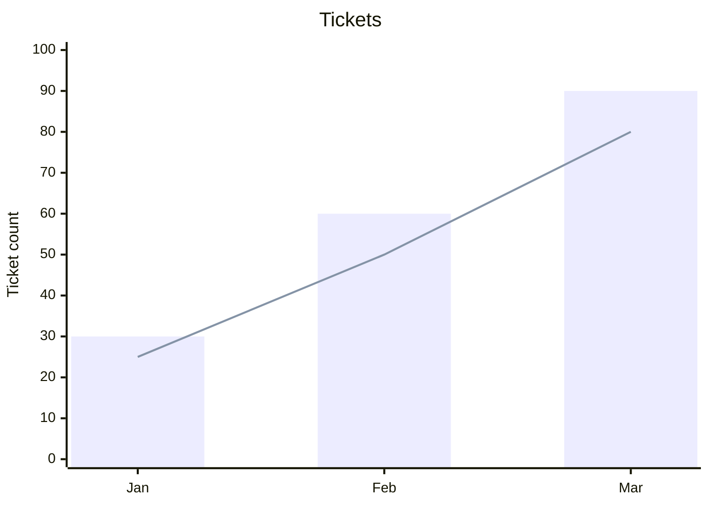
````

Use `chartforgex chart v1` when authors want ChartForgeX-native chart types or IX-specific visual artifact behavior that Mermaid does not define.

Sankey fences use Mermaid's CSV-like syntax and render through native ChartForgeX Sankey charts:

````markdown
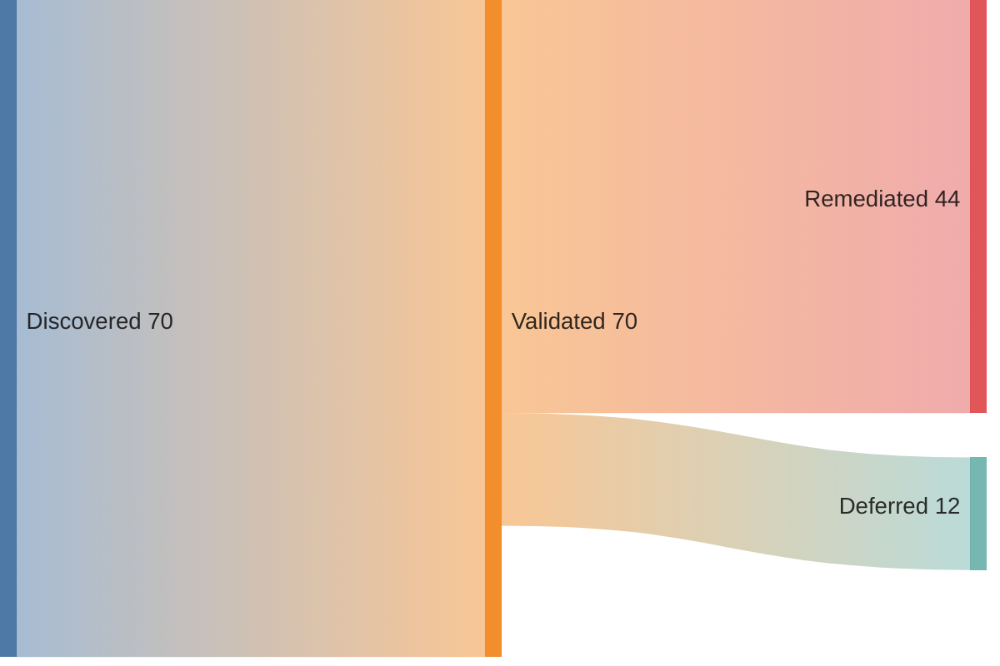
````

Radar fences use Mermaid's `radar-beta` syntax and render through native ChartForgeX radar charts:

````markdown
```mermaid {#capability-radar title="Capability Radar" width=900 height=620}
radar-beta
axis ux["User Experience"], api["API"], ops["Operations"]
curve current["Current"]{70, 65, 82}
curve target["Target"]{ux: 90, api: 88, ops: 92}
min 0
max 100
ticks 5
```
````

Treemap fences use Mermaid's `treemap-beta` syntax and render through native ChartForgeX treemap charts:

````markdown
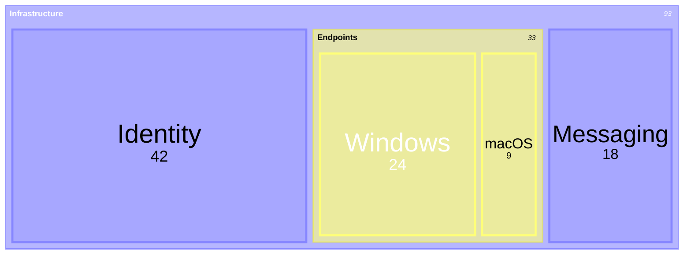
````

Gantt fences use Mermaid's `gantt` syntax and render through native ChartForgeX Gantt charts:

````markdown
```mermaid {#project-plan title="Project Plan" width=960 height=560 today=2026-01-08}
gantt
dateFormat YYYY-MM-DD
axisFormat %m/%d
section Build
Design : active, des, 2026-01-01, 5d
Implement : crit, impl, after des, 7d
Ship : milestone, ship, after impl, 0d
```
````

Git graph fences use Mermaid's `gitGraph` syntax and render through the reusable ChartForgeX git graph block:

````markdown
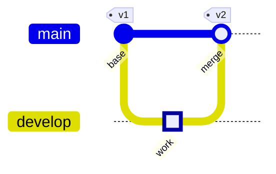
````

Packet fences use Mermaid's `packet-beta` syntax and render through the reusable ChartForgeX packet layout block:

````markdown
```mermaid {#tcp-header title="TCP Header" width=900 height=420 bitsPerRow=32}
packet-beta
0-15: "Source Port"
+16: "Destination Port"
32-63: "Sequence Number"
+32: "Acknowledgment Number"
```
````

Block fences use Mermaid's `block-beta` syntax and render through the reusable ChartForgeX block layout block:

````markdown
```mermaid {#service-path title="Service Path" width=900 height=420 columns=3}
block-beta
columns 3
frontend["Frontend"] api["API"] database[("Database")]
frontend --> api
api --> database
```
````

Venn fences use Mermaid's `venn-beta` syntax and render through the reusable ChartForgeX Venn diagram block:

````markdown
```mermaid {#capability-overlap title="Capability Overlap" width=780 height=460}
venn-beta
title Capability overlap
set API ["API"] : 60
set UI ["UI"] : 55
set Ops ["Operations"] : 45
union API,UI ["Shared UX"] : 18
union API,UI,Ops ["Platform"] : 5
```
````

Ishikawa fences use Mermaid's `ishikawa` and `ishikawa-beta` syntax and render through the reusable ChartForgeX fishbone block:

````markdown
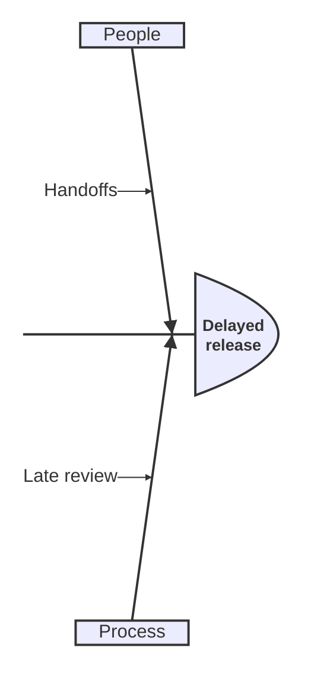
````

Wardley fences use Mermaid's `wardley-beta` syntax and render through the reusable ChartForgeX Wardley map block:

````markdown
```mermaid {#platform-map title="Platform Map" width=900 height=560}
wardley-beta
anchor User [0.95, 0.05]
component Portal [0.80, 0.35]
component API [0.70, 0.45]
User -> Portal
Portal -> API
```
````

TreeView fences use Mermaid's `treeView-beta` syntax and render through native ChartForgeX topology previews:

````markdown
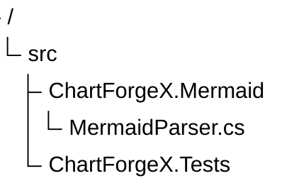
````

Event Modeling fences use Mermaid's `eventmodeling` syntax and render through native ChartForgeX topology previews:

````markdown
```mermaid {#cart-event-model title="Cart Event Model" width=960 height=560}
eventmodeling
tf 01 ui CartUI
tf 02 cmd AddItem
tf 03 evt ItemAdded
tf 04 rmo CartView ->> 03
```
````

Class, state, ER, requirement, architecture, C4, mindmap, and kanban fences render through native ChartForgeX topology previews:

````markdown
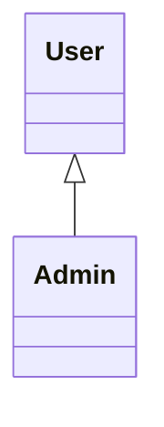
````

````markdown
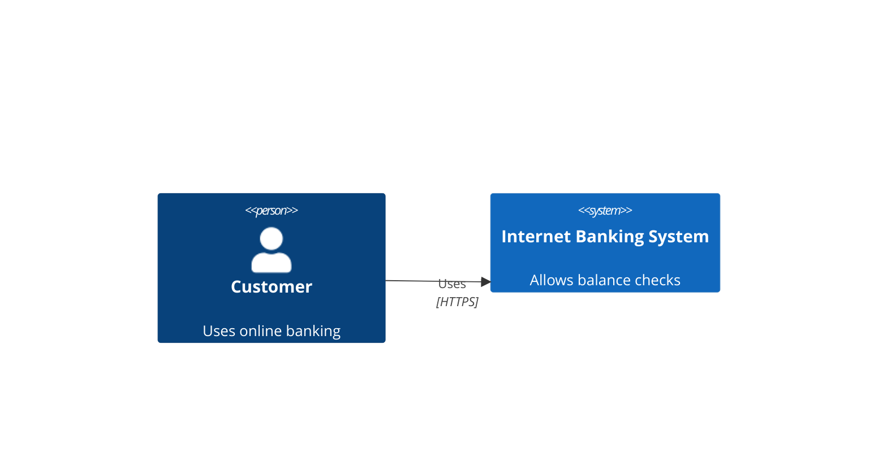
````

````markdown
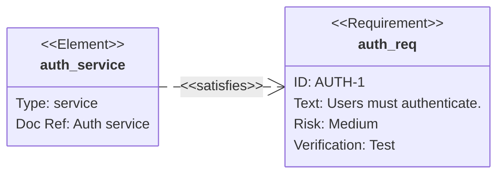
````

````markdown
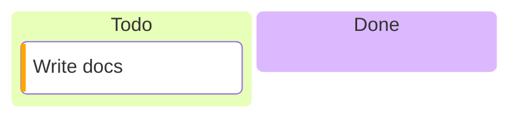
````

## CLI

The CLI validates, previews, and exports the same visual artifact surface as the markup parser. It supports topology, table, chart, and Mermaid-backed artifacts when the Mermaid bridge package is included in the CLI build. C# generation is currently topology-specific because only topology has a builder emitter today:

```powershell
dotnet run --project .\ChartForgeX.Markup.Cli\ChartForgeX.Markup.Cli.csproj -c Release -- validate .\diagram.md
dotnet run --project .\ChartForgeX.Markup.Cli\ChartForgeX.Markup.Cli.csproj -c Release -- preview .\diagram.md --output .\diagram.html
dotnet run --project .\ChartForgeX.Markup.Cli\ChartForgeX.Markup.Cli.csproj -c Release -- export .\diagram.md --output .\diagram.svg
dotnet run --project .\ChartForgeX.Markup.Cli\ChartForgeX.Markup.Cli.csproj -c Release -- emit .\diagram.md --target csharp --output .\diagram.cs
```

## VS Code extension

`ChartForgeX.Markup.VSCode` follows the same CLI-backed packaging model as `OfficeIMO.Markup.VSCode`. The extension shell stays thin: VS Code handles activation, commands, diagnostics, preview panels, and save dialogs, while `ChartForgeX.Markup.Cli` owns parsing, validation, rendering, export, and C# code generation.

The extension contributes a `chartforgex-markup` language for `.cfx.md` and `.chartforgex.md`, snippets for the native v1 fences, and commands for preview, validate, SVG/PNG/HTML export, C# generation, and opening the generated output folder. Packaging publishes the CLI into `tools/ChartForgeX.Markup.Cli` as a portable fallback plus self-contained runtime builds for Windows, Linux, and macOS.
