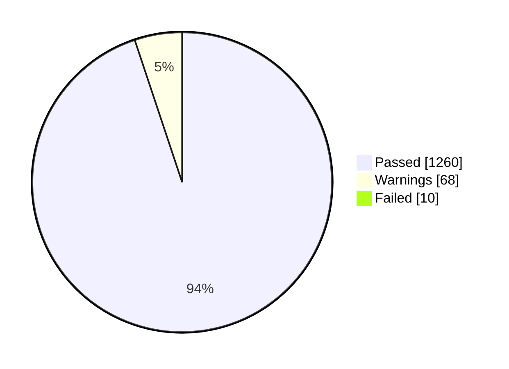
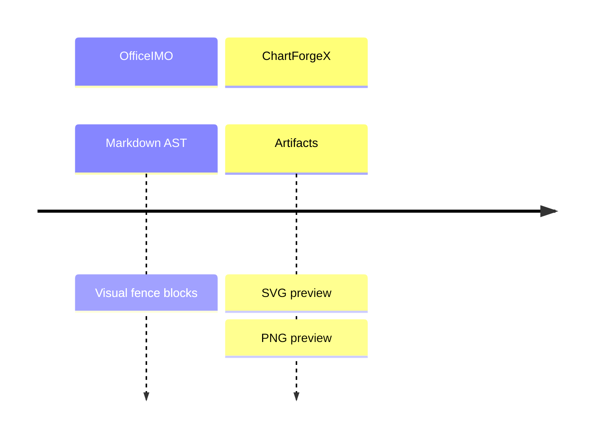
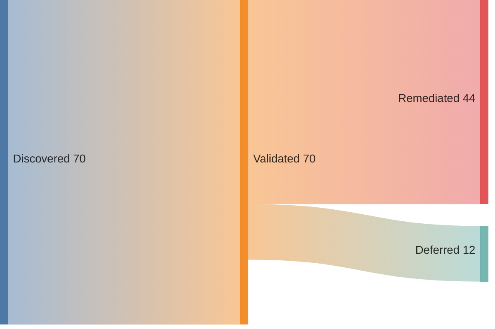
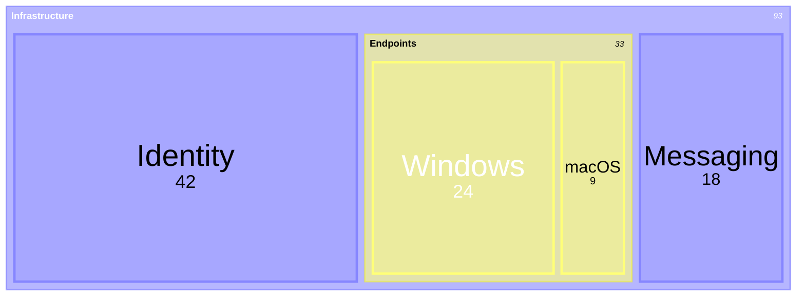

# Mermaid

ChartForgeX.Mermaid is the Mermaid language package for ChartForgeX. Its job is to parse Mermaid source into inspectable, source-preserving models and, where implemented, convert those models into deterministic ChartForgeX visuals.

It is intentionally separate from `ChartForgeX.Markup`:

- `ChartForgeX.Mermaid` owns Mermaid parsing, diagnostics, AST models, and Mermaid-to-ChartForgeX conversion.
- `ChartForgeX.Markup` owns generic Markdown fence scanning and built-in ChartForgeX fences.
- `ChartForgeX.Markup.Mermaid` is the optional bridge that adapts Mermaid fences into generic markup results.

This split keeps ChartForgeX dependency-free at runtime, keeps Markdown support reusable, and lets hosts opt into Mermaid only when they need it.

## Support Policy

Mermaid support should grow as a real language surface, not as a small custom subset that only works for demo strings.

For each Mermaid family ChartForgeX supports, the implementation should:

- Preserve the original source and one-based source spans for diagnostics.
- Parse Mermaid syntax into typed AST models before rendering.
- Keep raw statements where semantic coverage is still growing, so future parser work does not need to rediscover source structure.
- Detect recognized Mermaid diagram families even before they can render.
- Report unsupported or not-yet-renderable syntax clearly instead of silently pretending it rendered.
- Map implemented Mermaid concepts into ChartForgeX visual models with deterministic SVG and PNG output.
- Keep runtime parsing and rendering in .NET without requiring browser JavaScript.

Reference rendering tools can be useful in tests and compatibility checks, but they are not a runtime dependency for ChartForgeX packages.

## Current Scope

Flowchart, sequence, class, state, entity relationship, requirement, architecture, C4, git graph, block, packet, Venn, Ishikawa, Wardley, mindmap, tree view, event modeling, kanban, pie, journey, timeline, quadrant, Gantt, XY chart, Sankey, radar, and treemap diagrams have semantic implementations with static ChartForgeX rendering. Flowcharts, class diagrams, state diagrams, entity relationship diagrams, requirement diagrams, architecture diagrams, C4 diagrams, mindmaps, tree views, event modeling diagrams, and kanban boards render through `TopologyChart`; sequence diagrams render through `SequenceArtifact`; git graph diagrams render through `GitGraphBlock`; block diagrams render through `BlockLayoutBlock`; packet diagrams render through `PacketLayoutBlock`; Venn diagrams render through `VennDiagramBlock`; Ishikawa diagrams render through `FishboneDiagramBlock`; Wardley maps render through `WardleyMapBlock`; pie, journey, timeline, quadrant, Gantt, XY chart, Sankey, radar, and treemap diagrams render through native `Chart` models.

Recognized but not yet semantically parsed families include ZenUML. These produce an inspectable `MermaidDocument` with retained raw body statements plus a warning that the family is not implemented yet.

Unknown diagram families produce a parser error.

For the family-by-family completion status, evidence, and priority order, see `mermaid-support-matrix.md`.

## Flowcharts

Supported flowchart parsing includes:

- `flowchart` and `graph` headers.
- Directions such as `TD`, `TB`, `BT`, `LR`, and `RL`.
- YAML-style frontmatter and Mermaid directive comments.
- Common node references and labels.
- Common node shapes, including rectangle, rounded, stadium, subroutine, cylinder, circle, double circle, rhombus, hexagon, and parallelogram variants.
- Edge operators, pipe labels, inline labels, dotted operators, and chained edges.
- `subgraph ... end` groups.
- `classDef`, `class`, and inline `:::class` node classes.
- `style` node declarations.
- `click` href and tooltip metadata.
- `linkStyle` declarations, including numeric selectors and `default`.

```csharp
using ChartForgeX.Mermaid;

const string source = """
flowchart LR
classDef alert fill:#fee,stroke:#c00,color:#111
subgraph cluster[Cluster]
  api[API]:::alert --> db[(DB)]
end
style db fill:#eef,stroke:#00c
click api href "https://example.com/api" "Open API"
linkStyle 0 stroke:#f00,stroke-dasharray: 5 5
""";

var result = new MermaidParser().ParseFlowchart(source);
var document = result.Document;

var artifact = document!.ToVisualArtifact(new MermaidFlowchartRenderOptions {
    Id = "service-flow",
    Title = "Service Flow",
    Width = 1180,
    Height = 720
});

var svg = document.ToSvg();
var png = document.ToPng();
```

The conversion target for flowcharts is `TopologyChart`. Subgraphs become topology groups. Nodes become topology nodes. Edges become topology edges. Hrefs, tooltips, class names, source lines, Mermaid ids, and style metadata are retained where the topology model can carry them.

## Class Diagrams

Class diagrams are parsed into `MermaidClassDocument` and converted to topology previews.

Supported class parsing includes:

- `classDiagram` headers.
- `class Name` declarations.
- `class Name { ... }` member blocks.
- Class labels in `class id["Label"]` form.
- Class members added through blocks or `Class : member` statements.
- Annotations such as `<<interface>> ClassName`.
- Common relationship connectors such as inheritance, dependency, aggregation, composition, solid links, dotted links, and labels after `:`.
- `classDef`, `class`, `style`, `linkStyle`, and `cssClass` statements retained for future richer style mapping.

```csharp
using ChartForgeX.Mermaid;

const string source = """
classDiagram
class User {
  +string Name
  +Login() bool
}
<<service>> User
User <|-- Admin : extends
""";

var result = new MermaidParser().ParseClass(source);
var document = result.Document;
var artifact = document!.ToVisualArtifact(new MermaidTopologyRenderOptions {
    Id = "class-map"
});
```

The conversion target for class diagrams is `TopologyChart`. Classes become topology nodes, class relationships become topology edges, and annotations, member counts, connectors, ids, and source spans are retained in the AST or topology metadata.

## State Diagrams

State diagrams are parsed into `MermaidStateDocument` and converted to topology previews.

Supported state parsing includes:

- `stateDiagram` and `stateDiagram-v2` headers.
- `direction` statements.
- State declarations including `state "Label" as id`, `state id as "Label"`, and `state id <<choice>>`.
- Composite state blocks in `state id { ... }` form.
- Transitions using `-->` with optional labels after `:`.
- Start and end markers using `[*]`.
- Notes, classes, separators, and other non-transition statements retained as source statements.

```csharp
using ChartForgeX.Mermaid;

const string source = """
stateDiagram-v2
direction LR
[*] --> Idle
Idle --> Processing : submit
state Processing {
  [*] --> Validating
  Validating --> Done
}
Processing --> [*]
""";

var result = new MermaidParser().ParseState(source);
var document = result.Document;
var svg = document!.ToSvg();
```

The conversion target for state diagrams is `TopologyChart`. Composite states become topology groups, states become topology nodes, and transitions become directed topology edges.

## Entity Relationship Diagrams

Entity relationship diagrams are parsed into `MermaidEntityRelationshipDocument` and converted to topology previews.

Supported ER parsing includes:

- `erDiagram` headers.
- Entity declarations discovered from relationship rows.
- Entity blocks in `ENTITY { ... }` form.
- Attribute rows with type, name, optional key markers, and optional comments.
- Crow's-foot connectors such as `||--o{`, `}|..||`, and related solid/dotted combinations.
- Relationship labels after `:`.

```csharp
using ChartForgeX.Mermaid;

const string source = """
erDiagram
CUSTOMER ||--o{ ORDER : places
ORDER {
  string id PK
  string customerId FK
}
""";

var result = new MermaidParser().ParseEntityRelationship(source);
var document = result.Document;
var artifact = document!.ToVisualArtifact();
```

The conversion target for ER diagrams is `TopologyChart`. Entities become database-like topology nodes. Relationships become bidirectional mapping edges with Mermaid cardinality retained as metadata.

## Requirement Diagrams

Requirement diagrams are parsed into `MermaidRequirementDocument` and converted to topology previews.

Supported requirement parsing includes:

- `requirementDiagram` headers.
- Optional `direction` statements.
- Requirement blocks including `requirement`, `functionalRequirement`, `interfaceRequirement`, `performanceRequirement`, `physicalRequirement`, and `designConstraint`.
- Requirement fields for `id`, `text`, `risk`, and `verifymethod`.
- Element blocks with `type` and `docref`.
- Relationship rows such as `element - satisfies -> requirement` and reverse-arrow variants.
- `classDef`, `class`, `style`, and inline `:::class` statements retained for future richer style mapping.

```csharp
using ChartForgeX.Mermaid;

const string source = """
requirementDiagram
direction LR
functionalRequirement auth_req {
  id: "AUTH-1"
  text: Users must authenticate.
  risk: Medium
  verifymethod: Test
}
element auth_service {
  type: service
  docref: "Auth service"
}
auth_service - satisfies -> auth_req
""";

var result = new MermaidParser().ParseRequirement(source);
var document = result.Document;
var artifact = document!.ToVisualArtifact(new MermaidTopologyRenderOptions {
    Id = "requirements"
});
```

The conversion target for requirement diagrams is `TopologyChart`. Requirements and elements become topology nodes, relationships become directed topology edges, and requirement ids, types, risk, verification method, document references, classes, and source spans are retained in the AST or topology metadata.

## Architecture Diagrams

Architecture diagrams are parsed into `MermaidArchitectureDocument` and converted to topology previews.

Supported architecture parsing includes:

- `architecture-beta` headers.
- `group id(icon)[Title]` and `group id[Title]` declarations.
- `service id(icon)[Title]` and `service id[Title]` declarations.
- Optional `in parent` placement for services, junctions, and nested groups.
- `junction id` declarations.
- Edges using `-->`, `<--`, `<-->`, and `--`.
- Endpoint side metadata such as `service:R --> L:database`.
- Group-boundary edge modifiers such as `database{group}`.
- Source spans and raw statements for diagnostics and future fidelity work.

```csharp
using ChartForgeX.Mermaid;

const string source = """
architecture-beta
group api(cloud)[API]
group private(server)[Private API] in api
service gateway(internet)[Gateway] in api
service db(database)[Database] in private
junction split in api
gateway:R --> L:split
split:R --> L:db{group}
""";

var result = new MermaidParser().ParseArchitecture(source);
var document = result.Document;
var artifact = document!.ToVisualArtifact(new MermaidTopologyRenderOptions {
    Id = "service-architecture"
});
```

The conversion target for architecture diagrams is `TopologyChart`. Services and junctions become topology nodes, groups become topology groups, and edges become topology edges. Mermaid icon names, endpoint sides, group membership, nested group parent ids, group-boundary modifiers, operators, and source spans are retained in topology metadata so renderer fidelity can improve without losing source semantics.

## C4 Diagrams

C4 diagrams are parsed into `MermaidC4Document` and converted to topology previews.

Supported C4 parsing includes:

- `C4Context`, `C4Container`, `C4Component`, `C4Dynamic`, and `C4Deployment` headers.
- `title` and `direction` statements.
- People, systems, containers, components, database variants, queue variants, and external variants.
- Enterprise, system, container, generic boundary, and deployment-node boundary calls with nested block membership.
- Relationship calls including `Rel`, `BiRel`, directional `Rel_U`/`Rel_D`/`Rel_L`/`Rel_R` aliases, and `Rel_Back`.
- Source spans, raw statements, and explicit retained warnings for update/layout/style calls that are not rendered exactly yet.

```csharp
using ChartForgeX.Mermaid;

const string source = """
C4Container
title Container View
System_Boundary(bank, "Bank") {
  Person(customer, "Customer", "Uses online banking")
  Container(web, "Web Application", "ASP.NET", "Provides banking features")
  ContainerDb(db, "Database", "SQL", "Stores account data")
}
Rel(customer, web, "Uses", "HTTPS")
Rel_D(web, db, "Reads and writes", "SQL")
""";

var result = new MermaidParser().ParseC4(source);
var document = result.Document;
var artifact = document!.ToVisualArtifact(new MermaidTopologyRenderOptions {
    Id = "c4-container"
});
```

The conversion target for C4 diagrams is `TopologyChart`. Boundaries become topology groups, C4 elements become topology nodes, and relationships become topology edges. C4 kinds, descriptions, technology labels, tags, links, boundary membership, direction hints, and source spans are retained in the AST or topology metadata. Mermaid update/style/layout calls currently produce warnings and retained statements rather than silent visual degradation.

## Mindmaps

Mindmaps are parsed into `MermaidMindMapDocument` and converted to ChartForgeX's native mind-map topology layout.

Supported mindmap parsing includes:

- `mindmap` headers.
- Indentation-based parent/child hierarchy.
- Common node delimiters such as round, square, circle, cloud, and hexagon forms.
- Class markers with `:::className`.
- Icon markers with `::icon(...)`.

```csharp
using ChartForgeX.Mermaid;

const string source = """
mindmap
  Root((IX Visuals))
    Mermaid
      classDiagram:::important
    ChartForgeX
      TableArtifact::icon(fa fa-table)
""";

var result = new MermaidParser().ParseMindMap(source);
var document = result.Document;
var png = document!.ToPng();
```

The conversion target for mindmaps is `TopologyChart` with `TopologyLayoutMode.MindMap`. Nodes retain hierarchy, shape tokens, classes, icon markers, source spans, and generated stable ids.

## Tree View Diagrams

Tree view diagrams are parsed into `MermaidTreeViewDocument` and converted to deterministic hierarchy previews.

Supported tree view parsing includes:

- `treeView-beta` and `treeView` headers.
- Indentation-based hierarchy using spaces or tabs.
- Quoted labels with escaped quotes and backslashes.
- Unquoted labels for tolerant parsing of existing simple sources.
- Source spans and retained raw statements for diagnostics.

```csharp
using ChartForgeX.Mermaid;

const string source = """
treeView-beta
    "src"
        "ChartForgeX.Mermaid"
            "MermaidParser.cs"
            "MermaidTreeViewParser.cs"
    "README.md"
""";

var result = new MermaidParser().ParseTreeView(source);
var document = result.Document;
var artifact = document!.ToVisualArtifact(new MermaidTopologyRenderOptions {
    Id = "source-tree",
    Title = "Source Tree"
});
```

The conversion target for tree view diagrams is `TopologyChart`. Tree roots become hubs, intermediate nodes become branches, leaves become process nodes, and parent-child relationships become ownership edges. Static rendering is a ChartForgeX hierarchy preview, not a browser-pixel-perfect Mermaid clone.

## Event Modeling Diagrams

Event Modeling diagrams are parsed into `MermaidEventModelingDocument` and converted to deterministic topology swimlane previews.

Supported Event Modeling parsing includes:

- `eventmodeling` headers.
- Compact `tf` and relaxed `timeframe` statements.
- Compact `rf` and relaxed `resetframe` statements that break inferred flow.
- Entity type aliases for UI, processor, command, read model, and event frames.
- Namespace prefixes such as `Cart.ItemAdded` for swimlane grouping.
- Inline data such as `` `json`{ "cartId": 42 } ``.
- Data references in `[[identifier]]` form and ``data identifier `type`{ ... }`` blocks.
- Explicit `->>` source-frame relations, plus default inferred relations between adjacent non-reset frames.
- Source spans and retained raw statements for diagnostics.

```csharp
using ChartForgeX.Mermaid;

const string source = """
eventmodeling
tf 01 ui CartUI
tf 02 cmd AddItem
tf 03 evt Cart.ItemAdded [[ItemAdded01]]
tf 04 rmo Cart.CartView ->> 03
data ItemAdded01 `json`{
  "sku": "ABC",
  "quantity": 1
}
""";

var result = new MermaidParser().ParseEventModeling(source);
var document = result.Document;
var artifact = document!.ToVisualArtifact(new MermaidTopologyRenderOptions {
    Id = "cart-event-model",
    Title = "Cart Event Model"
});
```

The conversion target for Event Modeling diagrams is `TopologyChart`. Entity types map into UI/Automation, Command/Read Model, and Events swimlanes, with namespace-specific swimlanes when the source uses namespace prefixes. Static rendering preserves frame ids, entity identifiers, reset markers, data references, inline data, and inferred versus explicit relation metadata, but it is not a browser-pixel-perfect Event Modeling renderer.

## Kanban

Kanban diagrams are parsed into `MermaidKanbanDocument` and converted to grouped topology previews.

Supported kanban parsing includes:

- `kanban` headers.
- Column declarations in `id[Title]` form.
- Indented task declarations under columns.
- Task metadata blocks in `@{ key: "value" }` form.

```csharp
using ChartForgeX.Mermaid;

const string source = """
kanban
todo[Todo]
  docs[Write docs]@{ assigned: "Ana", ticket: "IX-1", priority: "High" }
doing[Doing]
  parser[Parser work]@{ priority: "Very High" }
done[Done]
""";

var result = new MermaidParser().ParseKanban(source);
var document = result.Document;
var artifact = document!.ToVisualArtifact();
```

The conversion target for kanban boards is `TopologyChart`. Columns become topology groups, tasks become process nodes, and task metadata is retained on the nodes.

## Journey Diagrams

Journey diagrams are parsed into `MermaidJourneyDocument` and converted to native ChartForgeX score charts.

Supported journey parsing includes:

- `journey` headers.
- Optional `title` statements.
- `section` groups.
- Scored task rows in `task: score: actor, actor` form.
- Source spans for sections and tasks.

```csharp
using ChartForgeX.Mermaid;

const string source = """
journey
title User Journey
section Start
  Open app: 5: User
  Find dashboard: 4: User, Analyst
""";

var result = new MermaidParser().ParseJourney(source);
var document = result.Document;
var artifact = document!.ToVisualArtifact(new MermaidJourneyRenderOptions {
    Id = "user-journey",
    Width = 960,
    Height = 560
});
```

The conversion target for journey diagrams is `Chart`. Sections, task scores, actors, task counts, actor counts, and source spans are retained in the AST or artifact metadata. Static rendering maps journey scores to deterministic ChartForgeX bars.

## Quadrant Charts

Quadrant charts are parsed into `MermaidQuadrantDocument` and converted to native ChartForgeX scatter charts.

Supported quadrant parsing includes:

- `quadrantChart` headers.
- Optional `title` statements.
- `x-axis low --> high` and `y-axis low --> high` labels.
- `quadrant-1` through `quadrant-4` labels.
- Point rows in `label: [x, y]` form.
- Source spans for labels and points.

```csharp
using ChartForgeX.Mermaid;

const string source = """
quadrantChart
title Reach and Engagement
x-axis Low Reach --> High Reach
y-axis Low Engagement --> High Engagement
Campaign A: [0.3, 0.6]
Campaign B: [0.7, 0.8]
""";

var result = new MermaidParser().ParseQuadrant(source);
var document = result.Document;
var artifact = document!.ToVisualArtifact(new MermaidQuadrantRenderOptions {
    Id = "reach-engagement",
    Width = 960,
    Height = 560
});
```

The conversion target for quadrant charts is `Chart`. Axis labels, quadrant labels, point counts, source spans, and point labels are retained in the AST or artifact metadata. Static rendering maps Mermaid points to deterministic ChartForgeX scatter marks.

## Sequence Diagrams

Sequence diagrams are parsed into `MermaidSequenceDocument` and can be converted to `SequenceArtifact` for deterministic static previews.

Supported sequence parsing includes:

- `sequenceDiagram` headers.
- Explicit `participant` and `actor` declarations.
- Participant aliases with `as`.
- Participant configuration objects with simple `type` and `alias` values.
- Implicit participants discovered through messages, notes, activations, and links.
- Message operators such as `->>`, `-->>`, `->`, `-->`, `-x`, `--x`, `-)`, and `--)`.
- Message text after `:`.
- Activation and deactivation shortcuts with `+` and `-` suffixes.
- `activate` and `deactivate` statements.
- `Note right of`, `Note left of`, and `Note over` statements.
- `loop`, `alt`, `else`, `opt`, `par`, `and`, `critical`, `option`, `rect`, and `end` block statements.
- `autonumber`, including optional start and increment values.
- Simple `link` actor menu entries and raw `links` JSON entries.

```csharp
using ChartForgeX.Mermaid;

const string source = """
sequenceDiagram
autonumber 10 0.5
participant U as User
actor API as Native API
participant DB {"type": "database", "alias": "Data Store"}
U->>+API: Request
activate API
API->>DB: Store
Note right of API: Processing
loop Every minute
  API-->>-U: Done
end
link API: Dashboard @ https://example.com/api
""";

var result = new MermaidParser().ParseSequence(source);
var document = result.Document;

var sequence = document!.ToSequenceArtifact(new MermaidSequenceRenderOptions {
    Id = "incident-sequence",
    Width = 960,
    Height = 560
});

var artifact = document.ToVisualArtifact();
var svg = document.ToSvg();
var png = document.ToPng();
```

The conversion target for sequence diagrams is `SequenceArtifact`. Participants, aliases, participant kinds, messages, notes, activations, block spans, autonumber settings, source lines, and actor links are retained as model data or metadata where the reusable artifact can carry them.

## Pie Charts

Pie diagrams are parsed into `MermaidPieDocument` and converted to native ChartForgeX pie charts.

Supported pie parsing includes:

- `pie` headers.
- Optional `showData` on the header line or as a body statement.
- Optional `title` statements.
- Quoted slice labels with positive numeric values.
- Source spans for every slice.

```csharp
using ChartForgeX.Mermaid;

const string source = """
pie showData
title "Result Mix"
"Passed" : 1260
"Warnings" : 68
"Failed" : 10
""";

var result = new MermaidParser().ParsePie(source);
var document = result.Document;

var artifact = document!.ToVisualArtifact(new MermaidPieRenderOptions {
    Id = "result-mix",
    Width = 820,
    Height = 460
});

var svg = document.ToSvg();
var png = document.ToPng();
```

The conversion target for pie diagrams is `Chart`. Slice order, labels, values, `showData`, source lines, and slice counts are preserved in the chart model or artifact metadata.

## Timelines

Timeline diagrams are parsed into `MermaidTimelineDocument` and converted to native ChartForgeX timeline charts.

Supported timeline parsing includes:

- `timeline` headers with optional `LR` or `TD` direction tokens.
- Optional `title` statements.
- `section` groups.
- Time-period rows in `period : event` form.
- Multiple inline events in `period : event : event` form.
- Continuation events on following lines starting with `:`.

```csharp
using ChartForgeX.Mermaid;

const string source = """
timeline TD
title Native Visuals
section OfficeIMO
Markdown AST : Visual fence blocks
section ChartForgeX
Artifacts : SVG preview : PNG preview
""";

var result = new MermaidParser().ParseTimeline(source);
var document = result.Document;

var artifact = document!.ToVisualArtifact(new MermaidTimelineRenderOptions {
    Id = "native-visuals",
    Width = 960,
    Height = 560
});

var svg = document.ToSvg();
var png = document.ToPng();
```

The conversion target for timelines is `Chart`. Mermaid sections, period labels, event counts, direction, title, and source spans are retained in the AST and artifact metadata. Static rendering maps Mermaid text periods onto ordered ChartForgeX timeline positions.

## Gantt Diagrams

Gantt diagrams are parsed into `MermaidGanttDocument` and converted to native ChartForgeX Gantt charts.

Supported Gantt parsing includes:

- `gantt` headers.
- Optional `title`, `dateFormat`, `axisFormat`, `tickInterval`, `excludes`, and `todayMarker` statements.
- `section` groups.
- Task metadata with optional tags: `active`, `done`, `crit`, and `milestone`.
- Task ids used by `after taskId` dependency clauses.
- Explicit start/end dates using the configured `dateFormat`.
- Durations using millisecond, second, minute, hour, day, and week units.
- Milestones as zero-duration native ChartForgeX milestones.

```csharp
using ChartForgeX.Mermaid;

const string source = """
gantt
title Project Plan
dateFormat YYYY-MM-DD
axisFormat %m/%d
section Build
Design : active, des, 2026-01-01, 5d
Implement : crit, impl, after des, 7d
Ship : milestone, ship, after impl, 0d
""";

var result = new MermaidParser().ParseGantt(source);
var document = result.Document;

var artifact = document!.ToVisualArtifact(new MermaidGanttRenderOptions {
    Id = "project-plan",
    Width = 960,
    Height = 560,
    Today = new DateTime(2026, 1, 8)
});

var svg = document.ToSvg();
var png = document.ToPng();
```

The conversion target for Gantt diagrams is `Chart`. Task ids, tags, sections, dependencies, date format, axis format, tick interval, excludes, today marker text, and source spans are retained in the AST or artifact metadata. Static rendering maps Mermaid tasks, milestones, dependencies, and optional caller-provided today markers onto ChartForgeX's dependency-free Gantt renderer. Exclusion calendars are preserved but not yet applied to duration math.

## XY Charts

XY charts are parsed into `MermaidXYChartDocument` and converted to native ChartForgeX cartesian charts.

Supported XY chart parsing includes:

- `xychart-beta` headers.
- Optional `horizontal` orientation.
- Optional `title` statements.
- `x-axis` category labels and numeric ranges.
- `y-axis` numeric ranges.
- `bar` and `line` series with numeric values.
- Source spans for every retained statement and series.

```csharp
using ChartForgeX.Mermaid;

const string source = """
xychart-beta
title Tickets
x-axis [Jan, Feb, Mar]
y-axis "Ticket count" 0 --> 100
bar [30, 60, 90]
line [25, 50, 80]
""";

var result = new MermaidParser().ParseXYChart(source);
var document = result.Document;

var artifact = document!.ToVisualArtifact(new MermaidXYChartRenderOptions {
    Id = "ticket-trend",
    Width = 900,
    Height = 520
});

var svg = document.ToSvg();
var png = document.ToPng();
```

The conversion target for XY charts is `Chart`. Category labels, axis ranges, series kind counts, orientation, title, and source spans are retained in the AST or artifact metadata. Static rendering maps vertical Mermaid bars to ChartForgeX bar series, horizontal Mermaid bars to horizontal bar series, and Mermaid lines to line series.

## Sankey Diagrams

Sankey diagrams are parsed into `MermaidSankeyDocument` and converted to native ChartForgeX Sankey charts.

Supported Sankey parsing includes:

- `sankey` and `sankey-beta` headers.
- CSV-like rows with exactly three columns: source, target, and positive value.
- Empty lines for visual grouping.
- Quoted commas in source and target labels.
- Doubled quotes inside quoted fields.
- Source spans for every retained CSV row.

```csharp
using ChartForgeX.Mermaid;

const string source = """
sankey-beta
Discovered,Validated,70
Validated,Remediated,44
Validated,Deferred,12
""";

var result = new MermaidParser().ParseSankey(source);
var document = result.Document;

var artifact = document!.ToVisualArtifact(new MermaidSankeyRenderOptions {
    Id = "triage-flow",
    Title = "Triage Flow",
    Width = 960,
    Height = 560
});

var svg = document.ToSvg();
var png = document.ToPng();
```

The conversion target for Sankey diagrams is `Chart`. Link order, source labels, target labels, positive values, link counts, and source spans are retained in the AST or artifact metadata. Static rendering uses ChartForgeX's dependency-free Sankey layout and SVG/PNG renderers.

## Radar Diagrams

Radar diagrams are parsed into `MermaidRadarDocument` and converted to native ChartForgeX radar charts.

Supported radar parsing includes:

- `radar-beta` headers.
- `title` statements.
- `axis` statements with ids and optional labels.
- `curve` statements with ordered values or `axisId: value` entries.
- `showLegend`, `min`, `max`, `ticks`, and `graticule` statements.
- Source spans for retained statements, axes, and curves.

```csharp
using ChartForgeX.Mermaid;

const string source = """
radar-beta
title Capability Radar
axis ux["User Experience"], api["API"], ops["Operations"]
curve current["Current"]{70, 65, 82}
curve target["Target"]{ux: 90, api: 88, ops: 92}
showLegend true
min 0
max 100
ticks 5
graticule polygon
""";

var result = new MermaidParser().ParseRadar(source);
var document = result.Document;

var artifact = document!.ToVisualArtifact(new MermaidRadarRenderOptions {
    Id = "capability-radar",
    Width = 900,
    Height = 620
});

var svg = document.ToSvg();
var png = document.ToPng();
```

The conversion target for radar diagrams is `Chart`. Axis labels, curve values, legend visibility, explicit min/max scale, tick count, graticule text, and source spans are retained in the AST or artifact metadata. Static rendering uses ChartForgeX's dependency-free radar SVG/PNG renderers; graticule is preserved as metadata until ChartForgeX grows alternate radar grid shapes.

## Treemap Diagrams

Treemap diagrams are parsed into `MermaidTreemapDocument` and converted to native ChartForgeX treemap charts.

Supported treemap parsing includes:

- `treemap-beta` headers.
- Quoted section/parent nodes.
- Quoted leaf nodes with finite non-negative numeric values.
- Indentation-based hierarchy using spaces or tabs.
- Optional `:::class` suffixes on section and leaf nodes.
- Source spans for retained statements and nodes.

```csharp
using ChartForgeX.Mermaid;

const string source = """
treemap-beta
"Infrastructure"
    "Identity": 42
    "Messaging": 18 :::risk
    "Endpoints"
        "Windows": 24
        "macOS": 9
""";

var result = new MermaidParser().ParseTreemap(source);
var document = result.Document;

var artifact = document!.ToVisualArtifact(new MermaidTreemapRenderOptions {
    Id = "infra-map",
    Title = "Infrastructure Map",
    Width = 960,
    Height = 560
});

var svg = document.ToSvg();
var png = document.ToPng();
```

The conversion target for treemap diagrams is `Chart`. The typed AST preserves the hierarchy and class suffixes. The current static ChartForgeX preview renders valued leaves as native treemap tiles using full hierarchy paths as labels, while node counts, leaf counts, root counts, and class usage are retained in artifact metadata for hosts that need the original tree.

## Git Graph Diagrams

Git graph diagrams are parsed into `MermaidGitGraphDocument` and converted to the reusable `GitGraphBlock` visual block.

Supported git graph parsing includes:

- `gitGraph` headers, including orientation tokens such as `LR:`.
- `commit` statements with `id`, `tag`, and `type` attributes.
- `branch` statements with optional `order` attributes.
- `checkout` branch switching.
- `merge` statements with generated or explicit merge commit ids.
- `cherry-pick` statements that retain the source commit id.
- Source spans and retained unsupported statements for diagnostics.

```csharp
using ChartForgeX.Mermaid;

const string source = """
gitGraph LR:
  commit id: "base" tag: "v1"
  branch develop order: 1
  checkout develop
  commit id: "work" type: HIGHLIGHT
  checkout main
  merge develop id: "merge" tag: "v2"
""";

var result = new MermaidParser().ParseGitGraph(source);
var document = result.Document;

var artifact = document!.ToVisualArtifact(new MermaidGitGraphRenderOptions {
    Id = "release-history",
    Title = "Release History",
    Width = 980,
    Height = 460
});
```

The conversion target for git graph diagrams is `GitGraphBlock`. Branches become lanes, commits become typed markers, and parent/merge/cherry-pick relationships become static connector lines. Mermaid config/theme details and alternate orientation-specific layout are retained or represented as metadata for future support; they are not silently treated as pixel-perfect Mermaid rendering.

## Block Diagrams

Block diagrams are parsed into `MermaidBlockDocument` and converted to the reusable `BlockLayoutBlock` visual block.

Supported block parsing includes:

- `block-beta` headers.
- `columns` statements, including `columns auto` with renderer defaults.
- Block ids, quoted labels, simple shape hints, and `:N` column spans.
- `space` and `space:N` layout gaps.
- Basic directed and undirected edges between blocks.
- Style/class and nested/composite block statements retained with warnings until the static renderer can apply them deliberately.

```csharp
using ChartForgeX.Mermaid;

const string source = """
block-beta
columns 3
frontend["Frontend"] api["API"] database[("Database")]
frontend --> api
api --> database
""";

var result = new MermaidParser().ParseBlock(source);
var document = result.Document;

var artifact = document!.ToVisualArtifact(new MermaidBlockRenderOptions {
    Id = "service-path",
    Title = "Service Path",
    Width = 900,
    Height = 420
});
```

The conversion target for block diagrams is `BlockLayoutBlock`. Mermaid block items become deterministic grid cells, spaces occupy grid columns without drawing, and edges render as static connectors. Nested/composite blocks, full Mermaid shape fidelity, and style/class application are preserved for future support but are not silently rendered as if complete.

## Packet Diagrams

Packet diagrams are parsed into `MermaidPacketDocument` and converted to the reusable `PacketLayoutBlock` visual block.

Supported packet parsing includes:

- `packet-beta` headers.
- Optional `title` statements.
- Explicit bit ranges such as `0-15: "Source Port"`.
- Single-bit fields such as `16: "Reserved"`.
- Relative bit-count fields such as `+32: "Payload"`.
- Contiguous-field validation from bit zero, matching Mermaid packet semantics.
- Source spans and retained statements for diagnostics.

```csharp
using ChartForgeX.Mermaid;

const string source = """
packet-beta
title TCP Header
0-15: "Source Port"
+16: "Destination Port"
32-63: "Sequence Number"
+32: "Acknowledgment Number"
""";

var result = new MermaidParser().ParsePacket(source);
var document = result.Document;

var artifact = document!.ToVisualArtifact(new MermaidPacketRenderOptions {
    Id = "tcp-header",
    Width = 900,
    Height = 420,
    BitsPerRow = 32
});

var svg = document.ToSvg();
var png = document.ToPng();
```

The conversion target for packet diagrams is `PacketLayoutBlock`. Packet fields become contiguous labeled bit rectangles with start/end bit metadata in SVG output. The same reusable block can be used directly from ChartForgeX without Mermaid.

## Venn Diagrams

Venn diagrams are parsed into `MermaidVennDocument` and converted to the reusable `VennDiagramBlock` visual block.

Supported Venn parsing includes:

- `venn-beta` headers.
- `title` statements.
- `set id [label] : size` declarations.
- `union id,id [label] : size` intersections for two or three sets.
- `text id,id textId [label]` statements.
- `style` statements for renderable `fill`, `stroke`, and `color` values.
- Source spans and retained statements for diagnostics.

```csharp
using ChartForgeX.Mermaid;

const string source = """
venn-beta
title Capability overlap
set API ["API"] : 60
set UI ["UI"] : 55
set Ops ["Operations"] : 45
union API,UI ["Shared UX"] : 18
union API,UI,Ops ["Platform"] : 5
""";

var result = new MermaidParser().ParseVenn(source);
var document = result.Document;

var artifact = document!.ToVisualArtifact(new MermaidVennRenderOptions {
    Id = "capability-overlap",
    Width = 780,
    Height = 460
});

var svg = document.ToSvg();
var png = document.ToPng();
```

The conversion target for Venn diagrams is `VennDiagramBlock`. Sets render as deterministic overlapping circles with set and intersection labels. Mermaid size values are retained in the AST and artifact metadata, but current static rendering is not area-proportional Euler layout and is intentionally limited to one, two, or three sets.

## Ishikawa Diagrams

Ishikawa diagrams are parsed into `MermaidIshikawaDocument` and converted to the reusable `FishboneDiagramBlock` visual block.

Supported Ishikawa parsing includes:

- `ishikawa` and `ishikawa-beta` headers.
- A root effect statement on the first body line.
- Indentation-based cause and sub-cause hierarchy.
- Source spans for the effect and each cause node.
- Retained raw statements for diagnostics.

```csharp
using ChartForgeX.Mermaid;

const string source = """
ishikawa-beta
Delayed release
  People
    Handoffs
      Timezone gaps
  Process
    Late review
  Platform
    Slow build
""";

var result = new MermaidParser().ParseIshikawa(source);
var document = result.Document;

var artifact = document!.ToVisualArtifact(new MermaidIshikawaRenderOptions {
    Id = "release-root-cause",
    Width = 900,
    Height = 520
});

var svg = document.ToSvg();
var png = document.ToPng();
```

The conversion target for Ishikawa diagrams is `FishboneDiagramBlock`. The static renderer produces a deterministic fishbone preview with the effect head, alternating primary causes, and nested sub-cause labels. It is not Mermaid's browser hand-drawn layout, and dense nested cause trees still need additional layout hardening.

## Wardley Maps

Wardley maps are parsed into `MermaidWardleyDocument` and converted to the reusable `WardleyMapBlock` visual block.

Supported Wardley parsing includes:

- `wardley-beta` headers.
- `title` and `size` statements.
- Custom evolution stage labels.
- Anchors and components with visibility/evolution coordinates.
- Node suffixes for inertia, sourcing strategy, and label offsets.
- Dependency links, dashed links, flow labels, and semicolon labels.
- `evolve`, `note`, `annotation`, `accelerator`, `deaccelerator`, and `pipeline` statements.
- Source spans and retained raw statements for diagnostics.

```csharp
using ChartForgeX.Mermaid;

const string source = """
wardley-beta
title Platform map
evolution Genesis -> Custom Built -> Product -> Commodity
anchor User [0.95, 0.05]
component Portal [0.80, 0.35]
component API [0.70, 0.45] (build)
User -> Portal
Portal +'uses'> API
evolve API 0.75
""";

var result = new MermaidParser().ParseWardley(source);
var document = result.Document;

var artifact = document!.ToVisualArtifact(new MermaidWardleyRenderOptions {
    Id = "platform-map",
    Width = 900,
    Height = 560
});

var svg = document.ToSvg();
var png = document.ToPng();
```

The conversion target for Wardley maps is `WardleyMapBlock`. The static renderer produces a deterministic map with axes, evolution stages, nodes, dependencies, evolutions, notes, annotations, markers, and pipelines. It is not Mermaid's browser layout, and advanced styling, annotation-box rendering, pipeline styling, and browser visual parity still need hardening.

## Visual Fidelity

ChartForgeX Mermaid rendering is deterministic ChartForgeX rendering, not a pixel-perfect clone of any browser renderer.

Flowchart rendering maps Mermaid concepts into the ChartForgeX topology visual vocabulary:

| Mermaid concept | ChartForgeX mapping |
| --- | --- |
| Flow direction | Topology layout direction. |
| Subgraph | Topology group. |
| Node label | Topology node label. |
| Edge label | Topology edge label. |
| `click` href and tooltip | Topology node href and tooltip. |
| `classDef`, `class`, `style` colors | Node style metadata and supported color fields. |
| `linkStyle stroke` | Edge color. |
| `linkStyle stroke-dasharray` | Dashed edge line style. |

When Mermaid exposes a concept that ChartForgeX cannot render exactly yet, keep it in the AST and metadata first, then add renderer mapping deliberately. That keeps the parser honest while allowing visual fidelity to improve without breaking the language model.

## Markdown Fences

Use `ChartForgeX.Markup.Mermaid` when Markdown documents should parse Mermaid fences:

```csharp
using ChartForgeX.Markup.Mermaid;

var result = new MermaidVisualMarkupParser().Parse(markdown);
foreach (var artifact in result.Artifacts) {
    // Render, inspect, export, or hand the artifact to a native host.
}
```

Hosts that already parse Markdown can pass discovered `VisualMarkupBlock` instances directly:

```csharp
var result = new MermaidVisualMarkupParser().ParseBlocks(blocks);
```

That flow keeps Mermaid syntax handling inside ChartForgeX while avoiding a second Markdown scan in native IX or OfficeIMO-backed pipelines.

Use `MermaidVisualMarkupRenderOptions` when a host wants shared defaults for several diagram families:

```csharp
using ChartForgeX.Markup.Mermaid;
using ChartForgeX.Mermaid;

var parser = new MermaidVisualMarkupParser(new MermaidVisualMarkupRenderOptions {
    Flowchart = new MermaidFlowchartRenderOptions { Width = 1180, Height = 720 },
    Gantt = new MermaidGanttRenderOptions { Width = 960, Height = 560 }
});

var result = parser.ParseBlocks(blocks);
```

Fence attributes such as `id`, `title`, `subtitle`, `width`, `height`, and family-specific render knobs use the same normalized option parsing as native ChartForgeX markup. Malformed numeric, boolean, or date values produce line-aware diagnostics instead of being silently ignored.

## Mermaid.js Conformance Fixtures

The repository includes a test-time Mermaid.js fixture harness under `tests/mermaid-conformance`. It validates representative Mermaid sources with the official Mermaid parser while keeping ChartForgeX packages dependency-free at runtime.

```powershell
Set-Location .\tests\mermaid-conformance
npm ci --ignore-scripts --no-audit --no-fund
npm run validate
```

`Build.ps1` runs the same conformance validation after the .NET test suite. Add fixtures here when expanding a supported Mermaid family so syntax compatibility is checked against Mermaid.js before ChartForgeX-specific rendering expectations are added.

````markdown
```mermaid {#incident-flow title="Incident Flow" subtitle="Static preview" width=1180 height=720}
flowchart LR
  alert[Alert] --> triage{Triage}
  triage -->|known| runbook[Runbook]
  triage -->|new| owner[Service owner]
```
````

````markdown
```mermaid {#incident-sequence title="Incident Sequence" width=960 height=560}
sequenceDiagram
participant U as User
actor API as Native API
U->>API: Request
API-->>U: Response
```
````

````markdown

````

````markdown

````

````markdown
```mermaid {#ticket-trend title="Ticket Trend" width=900 height=520 dataLabels=true}
xychart-beta
x-axis [Jan, Feb, Mar]
y-axis "Ticket count" 0 --> 100
bar [30, 60, 90]
line [25, 50, 80]
```
````

````markdown

````

````markdown
```mermaid {#capability-radar title="Capability Radar" width=900 height=620}
radar-beta
axis ux["User Experience"], api["API"], ops["Operations"]
curve current["Current"]{70, 65, 82}
curve target["Target"]{ux: 90, api: 88, ops: 92}
min 0
max 100
ticks 5
```
````

````markdown

````

````markdown
```mermaid {#project-plan title="Project Plan" width=960 height=560 today=2026-01-08}
gantt
dateFormat YYYY-MM-DD
axisFormat %m/%d
section Build
Design : active, des, 2026-01-01, 5d
Implement : crit, impl, after des, 7d
Ship : milestone, ship, after impl, 0d
```
````

Fence attributes currently understood by the bridge are `id`, `title`, `subtitle`, `width`, `height`, `padding`, `series`, `dataLabels`, and `today` where the target diagram type uses them.

## Growth Path

The next Mermaid families should follow the same pattern:

1. Detect the diagram family and preserve source spans.
2. Add typed AST nodes for the real Mermaid grammar used by that family.
3. Add diagnostics for unsupported syntax.
4. Convert to an existing ChartForgeX model when the mapping is natural, or introduce a reusable product-neutral artifact model when it is not.
5. Add focused parser tests, conversion tests, and static SVG/PNG smoke output.

For IX and other consuming hosts, the preferred integration is to accept Mermaid where users already know Mermaid, accept `chartforgex` fences where ChartForgeX adds richer native artifacts, and keep host-specific behavior outside the parser packages.
